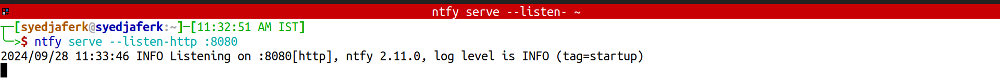
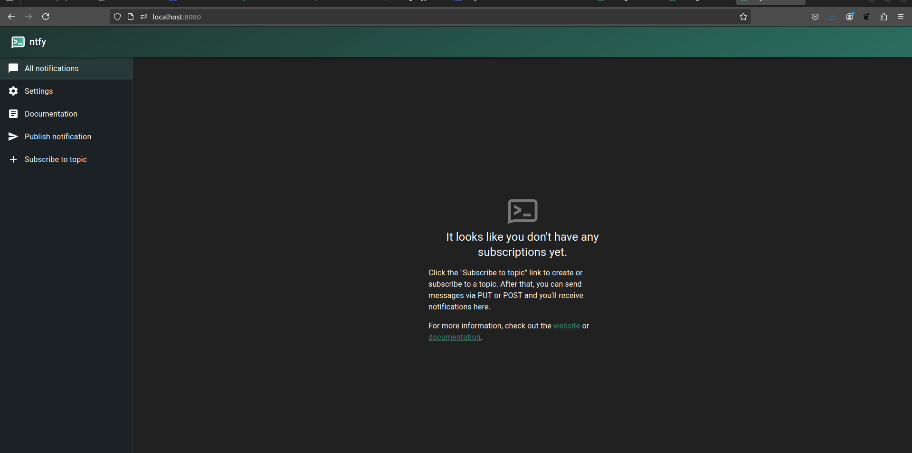
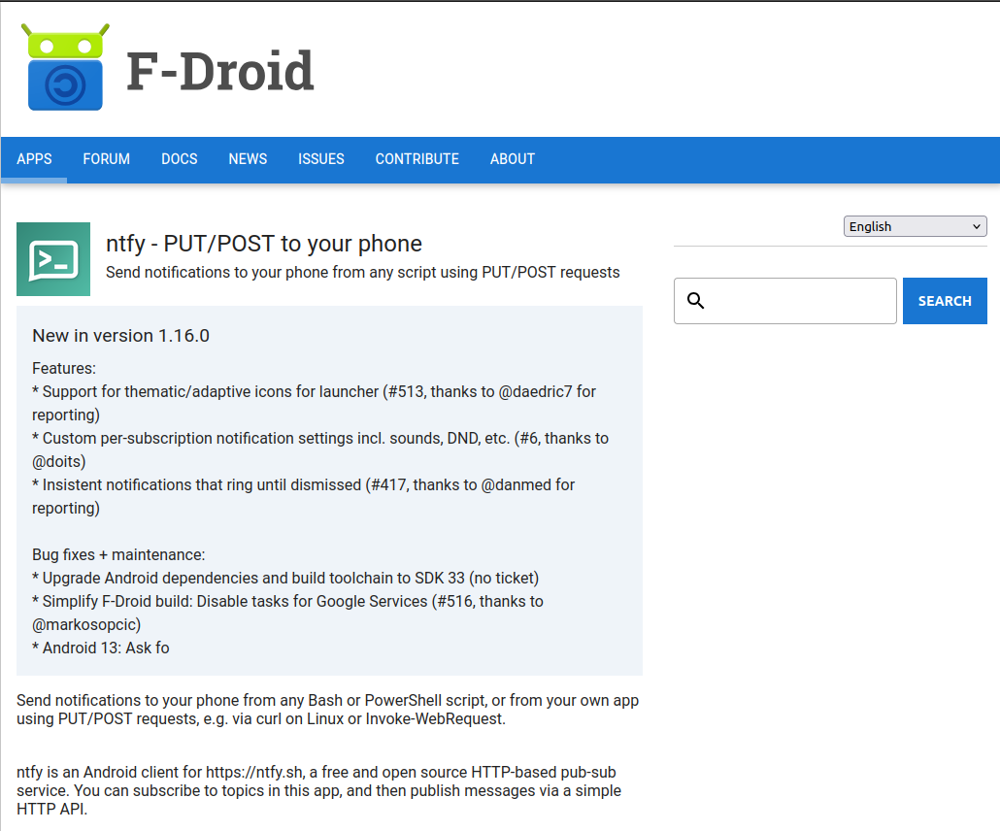

### ntfy.sh – To save you from un-noticed events

Alex Pandian was the system administrator for a tech company, responsible for managing servers, maintaining network stability, and ensuring that everything ran smoothly. 


With many scripts running daily and long-running processes that needed monitoring, Alex was constantly flooded with notifications.

**Alex Pandian:** “Every day, I have to gothrough dozens of emails and alerts just to find the ones that matter,”

Alex muttered while sipping coffee in the server room.

**Alex Pandian:** “There must be a better way to streamline all this information.”

Despite using several monitoring tools, the notifications from these systems were scattered and overwhelming. Alex needed a more efficient method to receive alerts only when crucial events occurred, such as script failures or the completion of resource-intensive tasks.

Determined to find a better system, Alex began searching online for a tool that could help consolidate and manage notifications.

After reading through countless forums and reviews, Alex stumbled upon a discussion about ntfy.sh, a service praised for its simplicity and flexibility.

“This looks promising,” Alex thought, excited by the ability to publish and subscribe to notifications using a straightforward, topic-based system. The idea of having notifications sent directly to a phone or desktop without needing complex configurations was exactly what Alex was looking for.

Alex decided to consult with Sam, a fellow system admin known for their expertise in automation and monitoring.

**Alex Pandian:** “Hey Sam, have you ever used ntfy.sh?”

**Sam:** “Absolutely, It’s a lifesaver for managing notifications. How do you plan to use it?”

**Alex Pandian:** “I’m thinking of using it for real-time alerts on script failures and long-running commands, Can you show me how it works?”

**Sam:** “Of course,”

with a smile, eager to guide Alex through setting up ntfy.sh to improve workflow efficiency. Let's Install...


### Step 0: Install ntfy.sh

Installation Docs: https://docs.ntfy.sh/install/

> Sam is installing on Alex Pandian Machine. 

Sam used to install using below script, 

```shell
wget https://github.com/binwiederhier/ntfy/releases/download/v2.11.0/ntfy_2.11.0_linux_amd64.deb
sudo dpkg -i ntfy_2.11.0_linux_amd64.deb
sudo systemctl enable ntfy
sudo systemctl start ntfy
```

**Sam:** Installation done !!!. Let's run an instance, 

```shell
ntfy serve --listen-http :8080
```



Let's see it in browser at http://localhost:8080, 




Also we should install it in mobile as well, 




### Step 1: Simple Hello World Notification

Alex, since we are doing in self-host, we need to configure server ip address in our mobile, 


Let's publish a simple hello-world notification with cli, 

```bash
curl -d "Hello World !" 192.168.0.9:8080/mytopic
```

Also we have to subscribe the same in our mobile to get the notification, 


That Simple it is. 

Together, Sam and Alex began configuring ntfy.sh for Alex’s environment. They focused on setting up topics and integrating them with existing systems to ensure that important notifications were delivered promptly.

> Subscribing using API: https://docs.ntfy.sh/subscribe/api/
> Publishing using API: https://docs.ntfy.sh/publish/


### Step 2: Identifying Key Topics

Alex identified the main areas where notifications were needed:

- script-failures: To receive alerts whenever a script failed.
- command-completions: To notify when long-running commands finished.
- server-health: For critical server health alerts.


### Step 3: Subscribing to Topics

Sam showed Alex how to subscribe to these topics using ntfy.sh on a mobile device and desktop. This ensured that Alex would receive notifications wherever they were, without having to constantly check email or dashboards.

**Sam:** Alex, If we are going to subscribe these messages in terminal using curl, there are 3 ways to get the stream using curl. (json, sse, raw). For now we can go with json. 


```bash
# Each line in separate terminal.
curl -s 192.168.0.9:8080/script-failures/json
curl -s 192.168.0.9:8080/command-completions/json
curl -s 192.168.0.9:8080/server-health/json
```

### Step 4: Automating Notifications

Sam explained how to use bash scripts and curl to send notifications to ntfy.sh whenever specific events occurred.

“For example, if a script fails, you can automatically send an alert to the ‘script-failures’ topic,” Sam demonstrated.

```bash
# Notify on script failure
./backup-script.sh || curl -d "Backup script failed!" 192.168.0.9:8080/script-failures
```

Alex was impressed by the simplicity and efficiency of this approach. “I can automate all of this?” Alex asked.

Definitely, Sam replied. "You can integrate it with cron jobs, monitoring tools, and more. It’s a great way to keep track of important events without getting bogged down by noise."

With the basics in place, Alex began applying ntfy.sh to various real-world scenarios, streamlining the notification process and improving overall efficiency.

### Wavering Ideas

With the basics in place, now alex thinks of situation where these stuffs can be used. 

#### 1. Monitoring Script Failures

Alex set up automated alerts for critical scripts that ran daily, ensuring that any failures were immediately reported. This allowed Alex to address issues quickly, minimizing downtime and improving system reliability.

```bash
	
# Notify on critical script failure
./critical-task.sh || curl -d "Critical task script failed!" 192.168.0.9:8080/script-failures
```

#### 2. Tracking Long-Running Commands

Whenever Alex initiated a long-running command, such as a server backup or data migration, notifications were sent upon completion. This enabled Alex to focus on other tasks without constantly checking on progress.

```bash
# Notify on long-running command completion
long-command && curl -d "Long command completed successfully." 192.168.0.9:8080/command-completions
```

#### 3. Server Health Alerts

To monitor server health, Alex integrated ntfy.sh with existing monitoring tools, ensuring that any critical issues were immediately flagged.

```bash
# Send server health alert
curl -d "Server CPU usage is critically high!" 192.168.0.9:8080/server-health
```

As with any new tool, there were challenges to overcome. Alex encountered a few hurdles, but with Sam’s guidance, these were quickly resolved.

#### 4. Managing Multiple Notifications

Initially, Alex found it challenging to manage multiple notifications and ensure that only critical alerts were prioritized. Sam suggested using filters and priorities to focus on the most important messages.

```bash
# Subscribe with filters for high-priority alerts
curl -s 192.168.0.9:8080/server-health/json?priority=high
```

#### 5. Scheduling Notifications

Alex wanted to schedule notifications for regular maintenance tasks and reminders. Sam introduced Alex to using cron for scheduling automated alerts.

```bash
# Schedule notification for regular maintenance
curl -H "At: tomorrow, 10am" -d "Time for weekly server maintenance." 192.168.0.9:8080/server-health
```

#### 6. Monitoring disk space

As a system administrator, you can use ntfy.sh to receive alerts when disk space usage reaches a critical level. This helps prevent issues related to insufficient disk space.

```bash
# disk_monitor.sh
# Check disk space and notify if usage is over 80%
disk_usage=$(df / | grep / | awk '{ print $5 }' | sed 's/%//g')
if [ $disk_usage -gt 80 ]; then
  curl -d "Warning: Disk space usage is at ${disk_usage}%." 192.168.0.9:8080/disk-space
fi
```

This can be run as a cronjob. 

#### 7. Notifying on Container Events with Docker

Integrate ntfy.sh with Docker to send alerts for specific container events, such as when a container stops unexpectedly.

```bash
# Notify on Docker container stop event
container_name="my_app"
container_status=$(docker inspect -f '{{.State.Status}}' $container_name)
 
if [ "$container_status" != "running" ]; then
  curl -d "Alert: Docker container $container_name has stopped." 192.168.0.9:8080/docker-alerts
fi
```

#### 8. Integrating with CI/CD Pipelines

Use ntfy.sh to notify you about the status of CI/CD pipeline stages, ensuring you stay informed about build successes or failures.

```yaml
# Example GitLab CI/CD YAML snippet
stages:
  - build
 
build_job:
  stage: build
  script:
    - make build
  after_script:
    - if [ "$CI_JOB_STATUS" == "success" ]; then
        curl -d "Build succeeded for commit $CI_COMMIT_SHORT_SHA." 192.168.0.9:8080/ci-cd-status;
      else
        curl -d "Build failed for commit $CI_COMMIT_SHORT_SHA." 192.168.0.9:8080/ci-cd-status;
      fi
```

With ntfy.sh as an integral part of daily operations, Alex found a renewed sense of balance and control. The once overwhelming chaos of notifications was now a manageable stream of valuable information.

As Alex reflected on the journey, it was clear that ntfy.sh had transformed not just the way notifications were managed, but also the overall approach to system administration.

In a world full of noise, ntfy.sh had provided a clear and effective way to stay informed without distractions. For Alex, it was more than just a tool—it was a new way of managing systems efficiently.


